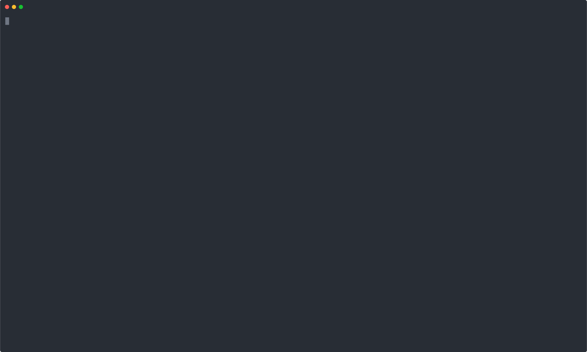

# Tunnelman

A Terminal User Interface (TUI) for managing remotely-managed Cloudflare Tunnels locally without needing the web browser.



Manage your Cloudflare-hosted tunnels (the ones created and configured via Cloudflare dashboard) directly from your terminal with real-time status monitoring and hostname management.

Motivation: I like using Cloudflare Tunnels instead of other tools like ngok, localtunnel for my sharing my local services / personal projects with workmates / friends but always found the web UI to be clunky and not very intuitive.

PS: I've only tested this on macOS.

## Features

- **Real-time Status** - view tunnel health (HEALTHY/DOWN) instantly
- **Local Management of Remote Tunnels** - control Cloudflare-hosted tunnels from your terminal
- **No Web Browser Required** - tunnel management without opening the web dashboard
- **Hostname Management** - add, edit, delete public hostnames. also removes the dns record on deletion
- **Browser Integration** - press 'o' to open specific tunnel config when needed
- **Cross-platform** binaries and Debian packages

## Installation

### Download Binary (Recommended)

Download the latest release for your platform from the [releases page](https://github.com/justingosan/tunnelman/releases):

#### Linux
```bash
# Download and install (AMD64)
wget https://github.com/justingosan/tunnelman/releases/latest/download/tunnelman-linux-amd64.tar.gz
tar -xzf tunnelman-linux-amd64.tar.gz
sudo mv tunnelman-linux-amd64 /usr/local/bin/tunnelman
chmod +x /usr/local/bin/tunnelman
```

#### Debian/Ubuntu Package
```bash
# Download and install .deb package
wget https://github.com/justingosan/tunnelman/releases/latest/download/tunnelman_*_amd64.deb
sudo dpkg -i tunnelman_*_amd64.deb

# Install dependencies if needed
sudo apt-get install -f
```

#### macOS
```bash
# Intel Macs
wget https://github.com/justingosan/tunnelman/releases/latest/download/tunnelman-darwin-amd64.tar.gz
tar -xzf tunnelman-darwin-amd64.tar.gz
sudo mv tunnelman-darwin-amd64 /usr/local/bin/tunnelman
chmod +x /usr/local/bin/tunnelman

# Apple Silicon Macs
wget https://github.com/justingosan/tunnelman/releases/latest/download/tunnelman-darwin-arm64.tar.gz
tar -xzf tunnelman-darwin-arm64.tar.gz
sudo mv tunnelman-darwin-arm64 /usr/local/bin/tunnelman
chmod +x /usr/local/bin/tunnelman
```

### Prerequisites

- `cloudflared` CLI tool installed and configured
- Cloudflare account with API access

### Install cloudflared

```bash
# macOS
brew install cloudflared

# Linux
wget -q https://github.com/cloudflare/cloudflared/releases/latest/download/cloudflared-linux-amd64.deb
sudo dpkg -i cloudflared-linux-amd64.deb


### Build from Source

If you prefer to build from source or need the latest development version:

```bash
# Prerequisites: Go 1.24.4 or later
git clone https://github.com/justingosan/tunnelman.git
cd tunnelman
go build -o tunnelman .
```

## Quick Setup

1. **Get Cloudflare API Token**: Visit [Cloudflare API Tokens](https://dash.cloudflare.com/profile/api-tokens)
2. **Create Custom Token**: Choose "Custom token" with permissions:
   - `Account:Cloudflare Tunnel:Edit`
3. **Install cloudflared**: `brew install cloudflared` (or see [Installation](#installation))
4. **Configure tunnelman**: Run `tunnelman config` for interactive setup

## Configuration

### Interactive Setup (Recommended)

```bash
tunnelman config
```

This will guide you through setting up your Cloudflare API credentials interactively.

### Manual Configuration

Alternatively, create `~/.tunnelman/config.json`:

```json
{
  "cloudflare_api_key": "your-api-key-or-token",
  "cloudflare_email": "your-email@example.com"
}
```

**Note**: `cloudflare_email` is optional when using API tokens

### Environment Variables

Alternatively, use environment variables:

```bash
export CLOUDFLARE_API_KEY="your-api-key"
export CLOUDFLARE_EMAIL="your-email@example.com"  # Optional
```

## Usage

### Start the TUI

```bash
./tunnelman
```

### Main Interface

The main interface displays:
- **Tunnel List**: Shows all tunnels with their status and domain counts
- **Actions**: Create new tunnels, manage hostnames

### Hostname Management

1. **Add Hostname**: Select a tunnel and choose "Add Hostname"
   - Enter hostname prefix
   - Select domain from dropdown
   - Set path (defaults to `*`)
   - Set service URL (defaults to `http://localhost:8080`)

2. **Edit Hostname**: Select existing hostname to modify
   - Update service URL
   - Change path routing

3. **Remove Hostname**: Delete unwanted hostname configurations including the DNS record

### Key Components

- **Bubble Tea**: TUI framework for interactive terminal applications
- **Lipgloss**: Styling and layout for terminal interfaces
- **Cloudflare Go SDK**: Official API client for Cloudflare services
- **cloudflared CLI**: Command-line tool for tunnel operations

### Building

```bash
# Build for current platform
make build

# Build for all platforms
make build-all

# Install locally
make install
```

### Testing

```bash
# Run unit tests
make test

# Run E2E tests (requires valid Cloudflare credentials)
make test-e2e

# Run specific E2E test
go test -v -run TestE2E_TunnelLifecycle

# Run tests with timeout
./scripts/run_e2e_tests.sh
```

### E2E Testing

The E2E test suite provides comprehensive testing of:
- Tunnel lifecycle (create, list, info, status, delete)
- Hostname management (add, update, remove, list)
- Configuration management (get, update)
- Error handling for invalid operations
- Full workflow integration tests

Tests automatically clean up resources and use unique naming to avoid conflicts.

## API Integration

### Cloudflare API

The application integrates with:
- **Cloudflare API v4**: For tunnel and account management
- **cloudflared CLI**: For tunnel operations and DNS routing
- **Tunnel Configuration API**: For hostname management

### Authentication

Supports both API keys and API tokens:
- **API Key**: Requires email + global API key
- **API Token**: Recommended, only needs `Account:Cloudflare Tunnel:Edit` permission

## Contributing

1. Fork the repository
2. Create a feature branch
3. Make your changes
4. Add tests for new functionality
5. Run the test suite
6. Submit a pull request

### Development Setup

```bash
# Clone your fork
git clone https://github.com/justingosan/tunnelman.git
cd tunnelman

# Install dependencies
go mod tidy

# Run tests
make test

# Build and test locally
make build
./tunnelman
```

## License

MIT License - see [LICENSE](LICENSE) file for details.

## Support

- **Issues**: Report bugs and feature requests on GitHub
- **Documentation**: Check the `docs/` directory for detailed guides
- **Community**: Join discussions in GitHub Discussions

## Changelog

### Latest Features

- ✅ Domain dropdown for hostname creation
- ✅ Improved table formatting and column alignment
- ✅ Hierarchical escape key navigation
- ✅ Domain count display instead of connection count
- ✅ Comprehensive E2E test suite
- ✅ Real-time tunnel status monitoring
- ✅ Enhanced error handling and user feedback

---

Built with ❤️ using Go and Bubble Tea
